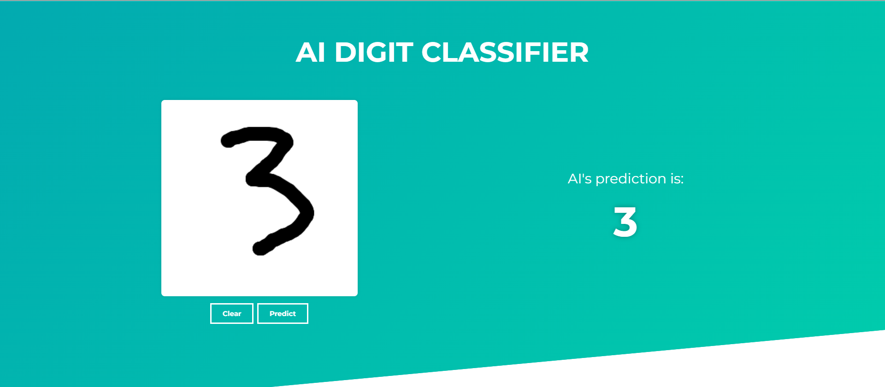

# 🧠 Digit Classifier

Draw digits in your browser and get real-time predictions from a neural network trained on MNIST.  
Built with a **Convolutional Neural Network (CNN)** using **PyTorch**, deployed through a **FastAPI** backend, and accessed via a **React** frontend.

🔗 **Live Demo:** [digit.benjamindettling.ch](https://digit.benjamindettling.ch)

---

## ✨ Features

- 🎨 Interactive canvas for drawing digits (HTML5 Canvas API)
- 🧠 **CNN model** trained on the MNIST dataset using PyTorch
- 💾 Model serialized as a `.pth` file and loaded at runtime for inference
- 📤 Frontend sends base64-encoded images to the backend via POST
- 🔁 FastAPI backend processes and classifies the input using PyTorch
- ⚡ Real-time predictions returned via a **REST API**
- 🌍 Deployed with **Netlify** (frontend) and **Render** (backend)
- 🚦 Backend served using **Uvicorn**, a lightning-fast ASGI server

---

## 🛠 Tech Stack

**Frontend**
- React + Vite
- SCSS Modules
- HTML Canvas API

**Backend**
- FastAPI
- PyTorch (CNN inference)
- Uvicorn (ASGI server)
- PIL (image decoding and preprocessing)

---

## 📂 Project Structure

- [`digit-classifier-client`](https://github.com/benjamindettling/digit-classifier-client)  
  → React app with a canvas-based UI for drawing and submitting digits

- [`digit-classifier-server`](https://github.com/benjamindettling/digit-classifier-server)  
  → FastAPI backend that loads a serialized PyTorch CNN model and performs digit classification

---

## 📸 Screenshot

  

---

## 💡 Challenges & Learnings

- 🧠 Trained my **first neural network** from scratch using PyTorch (CNN architecture)
- 🔁 Connected a Python-based backend to a modern React frontend
- 📤 Handled base64 image transmission and decoding between browser and server
- 🌐 Deployed a full-stack machine learning app using Netlify and Render
- ⏳ Encountered cold start delays on Render (an ongoing challenge with free-tier hosting)

> This project was a fun deep-dive into ML model deployment, real-time frontend-backend communication, and full-stack integration using modern web tools.
